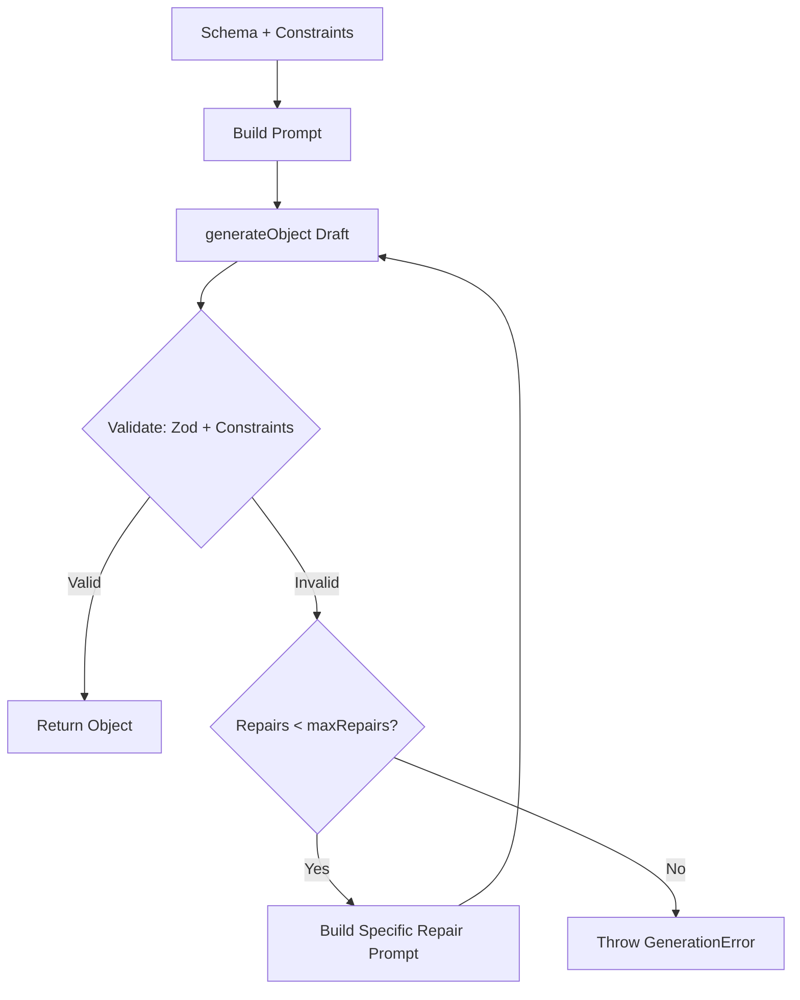

# quest-forge

> Schema-first game content generator powered by Vercel AI SDK, Zod, and balance constraints.

<!--  TODO: add GIF -->

`quest-forge` helps game developers define structured content (quests, items, NPCs) as Zod schemas with balance constraints. It generates batches of valid objects via the Vercel AI SDK `generateObject`, featuring automatic validation and an iterative repair loop on errors.

---

## Security Note

> **Warning**: `--schema` executes the file as code, only point it at files you trust.

---

## Requirements

- **Node.js**: `>= 20.0.0`
- **API Key**: `OPENAI_API_KEY` or `ANTHROPIC_API_KEY` (for CLI & production LLM execution)

---

## Installation

```bash
npm install quest-forge zod ai
```

---

## CLI Usage & Output Modes

`quest-forge` CLI supports three output modes:

### 1. Default (Human-Readable Terminal Cards)
Outputs colorful formatted cards to stdout. Perfect for quick local inspection:
```bash
npx quest-forge generate \
  --schema ./examples/quest.schema.ts \
  --count 5 \
  --param level=5 \
  --model openai:gpt-4o-mini
```

### 2. File Output (`--out`)
Saves a formatted JSON array to a file:
```bash
npx quest-forge generate \
  --schema ./examples/quest.schema.ts \
  --count 10 \
  --out quests.json \
  --model openai:gpt-4o-mini
```

### 3. Raw JSON Stream (`--json`)
Outputs a JSON array directly to stdout for shell pipes (e.g. `jq`):
```bash
npx quest-forge generate \
  --schema ./examples/quest.schema.ts \
  --count 5 \
  --json \
  --model openai:gpt-4o-mini | jq '.[] | .title'
```

### CLI Options

| Flag | Short | Description | Default |
| :--- | :--- | :--- | :--- |
| `--schema` | `-s` | Path to `.ts`/`.js` Zod schema file | Required |
| `--count` | `-c` | Number of items to generate | `1` |
| `--out` | `-o` | Output JSON file path | — |
| `--json` | — | Output raw JSON array to `stdout` | `false` |
| `--model` | `-m` | Provider and model (`openai:gpt-4o-mini`, `anthropic:claude-3-5-sonnet-20241022`) | — |
| `--param` | `-p` | Generation parameters (`key=value`, repeatable) | `{}` |
| `--concurrency` | — | Parallel generation worker limit | `3` |
| `--temperature` | `-t` | Model sampling temperature (`0` to `2`) | Model default |

---

## Programmatic API

### 1. Define a Schema & Generator

```typescript
import { z } from "zod";
import { defineGenerator, range, oneOf } from "quest-forge";
import { openai } from "@ai-sdk/openai";

const questSchema = z.object({
  title: z.string().describe("Descriptive title of the fantasy quest"),
  requiredLevel: z.number().describe("Minimum player level required"),
  reward: z.object({
    gold: z.number().describe("Gold awarded upon completion"),
  }),
});

const generator = defineGenerator({
  schema: questSchema,
  constraints: [
    range("reward.gold", (_obj, params) => {
      const level = (params?.level as number) || 1;
      return [level * 10, level * 50];
    }),
  ],
  model: openai("gpt-4o-mini"),
  temperature: 0.7,
  maxRepairs: 3,
});
```

### 2. Generate a Single Object (`generate`)

```typescript
const quest = await generator.generate({ level: 5 });
console.log(quest);
```

### 3. Generate a Batch (`generateBatch`)

```typescript
const { items, failures } = await generator.generateBatch({
  count: 20,
  concurrency: 3,
  temperature: 0.8,
  params: { level: 5 },
  onProgress: ({ completed, total }) => {
    console.log(`Generated ${completed}/${total}...`);
  },
});

console.log(`Successfully generated ${items.length} items.`);
if (failures.length > 0) {
  console.warn(`${failures.length} items failed validation after max repairs.`);
}
```

---

## Balance Constraints Reference

`quest-forge` provides three constraint helpers to enforce balance rules beyond static Zod structural types:

| Helper | Signature | Description |
| :--- | :--- | :--- |
| `range` | `range(path, bounds)` | Enforces numeric value bounds. `bounds` can be `[min, max]` or a function `(obj, params) => [min, max]`. |
| `oneOf` | `oneOf(path, values)` | Enforces element inclusion in an allowed list. `values` can be array or `(obj, params) => array`. |
| `custom` | `custom(fn)` | Custom balance rule. `fn(obj, params)` returns `string` error message or `null` if valid. |

Example nested path constraint:
```typescript
range("reward.gold", (_obj, params) => [
  ((params?.level as number) ?? 1) * 10,
  ((params?.level as number) ?? 1) * 50,
])
```

---

## Automatic Validation & Repair Loop

When the LLM generates an object, `quest-forge` runs both Zod structural validation and balance constraints. If any issue is found, it automatically builds a specific repair prompt and re-invokes the LLM up to `maxRepairs` (default: 3).



---

## FAQ

### 1. How much does a batch of 100 items cost?
Token consumption depends on schema complexity and model choice. Using `gpt-4o-mini` with a typical 200-token prompt and 150-token output per object, a batch of 100 items costs approximately $0.01 – $0.03 total.

### 2. Why do unit tests use `MockLanguageModelV1`?
To guarantee fast, deterministic, offline CI builds without requiring real API keys or incurring LLM API costs.

### 3. What happens if an item reaches `maxRepairs`?
If an item fails validation after `maxRepairs` (e.g. 3 repairs = 4 total attempts), it is added to the `failures` array in `generateBatch` without aborting the rest of the batch. In single `generate()`, a `GenerationError` is thrown.

### 4. What concurrency setting should I use for duplicate prevention?
While higher concurrency speeds up generation, concurrent tasks generate items simultaneously without knowing what names other active workers will choose. If your schema requires unique `name` or `title` fields across a batch, keep `concurrency` around `1-3`. This ensures accepted names are added to `avoidNames` immediately after each item completes, minimizing duplicate collisions.

---

## License

[MIT License](LICENSE) © 2026 Koval09
