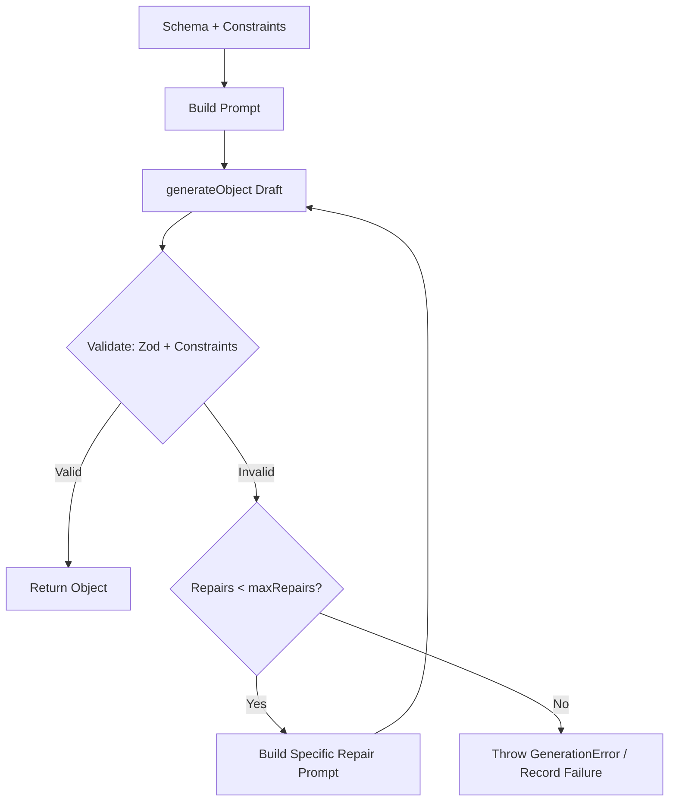

# quest-forge

[](https://www.npmjs.com/package/quest-forge)
[](https://github.com/Koval09/quest-forge/actions)
[](LICENSE)

> Schema-first game content generator powered by Vercel AI SDK, Zod, and balance constraints.

`quest-forge` helps game developers generate structured, perfectly balanced game content (quests, items, NPCs, loot tables). Instead of relying on raw LLM prompts that easily break structural rules or game balance, `quest-forge` combines Zod schemas with custom balance rules and an automatic iterative repair loop.

---

## Key Features

- 🛡️ **Zod Schema First**: Type-safe generation derived directly from your Zod schemas.
- ⚖️ **Dynamic Balance Constraints**: Enforce complex game math & range rules (e.g. gold rewards scaled by level).
- 🔄 **Self-Healing Repair Loop**: Automatic validation and targeted re-prompting when LLMs generate invalid fields.
- 🚀 **Batch Generation & Deduplication**: Generate hundreds of items with built-in title/name duplicate prevention.
- 🖥️ **Developer CLI**: Inspect items as colorized terminal cards, pipe raw JSON to `jq`, or export to files.

---

## Requirements

- **Node.js**: `>= 20.0.0`
- **API Key**: `OPENAI_API_KEY` or `ANTHROPIC_API_KEY` (for CLI & LLM execution)

---

## Installation

```bash
npm install quest-forge zod ai
```

---

## 60-Second Quick Start

Generate 10 valid quest objects using the CLI and an example schema:

```bash
# Set your API key
export OPENAI_API_KEY="your-openai-api-key"

# Generate 10 quests with level and theme parameters
npx quest-forge generate \
  --schema ./examples/quest.schema.ts \
  --count 10 \
  --param level=5 \
  --param theme=dark_forest \
  --model openai:gpt-4o-mini \
  --out quests.json
```

---

## CLI Reference

`quest-forge` includes a CLI tool for generating content directly from schema files.

> **Security Note**: `--schema` executes the specified file as code via `jiti`. Only load schema files from trusted sources.

### Options

| Flag | Short | Type | Default | Description |
| :--- | :--- | :--- | :--- | :--- |
| `--schema` | `-s` | `string` | Required | Path to `.ts`/`.js` Zod schema file |
| `--count` | `-c` | `number` | `1` | Number of items to generate |
| `--param` | `-p` | `string` | `{}` | Generation parameters (`key=value`, repeatable) |
| `--model` | `-m` | `string` | — | Provider and model spec (`openai:gpt-4o-mini`, `anthropic:claude-3-5-sonnet-20241022`) |
| `--out` | `-o` | `string` | — | Output JSON file path |
| `--json` | — | `boolean` | `false` | Output raw JSON array to `stdout` |
| `--temperature` | `-t` | `number` | Model default | Sampling temperature (`0` to `2`) |
| `--concurrency` | — | `number` | `3` | Number of concurrent generation workers |

### CLI Schema File Format

To use a schema file with the CLI, export a default object containing `schema`, optional `constraints`, and optional `examples`:

```typescript
// quest.schema.ts
import { z } from "zod";
import { range, oneOf } from "quest-forge";

export const questSchema = z.object({
  title: z.string().describe("Quest title"),
  requiredLevel: z.number(),
  difficulty: z.enum(["easy", "medium", "hard"]),
});

export default {
  schema: questSchema,
  constraints: [
    range("requiredLevel", (_obj, params) => {
      const level = (params?.level as number) || 1;
      return [Math.max(1, level - 2), level + 2];
    }),
    oneOf("difficulty", ["easy", "medium", "hard"]),
  ],
  examples: [
    { title: "The Goblin Raid", requiredLevel: 3, difficulty: "easy" },
  ],
};
```

### Output Modes

> **Note**: Without `--out` or `--json`, generated items are **only printed to stdout and NOT saved to any file**.
>
> Progress updates (`Generating X/Y...`) and failure summaries are written to `stderr`, keeping `stdout` clean for UNIX redirection and piping.

#### 1. Default Mode (Human-Readable Terminal Cards)
Outputs formatted, colorized cards to `stdout`. Perfect for quick terminal inspection:
```bash
npx quest-forge generate \
  --schema ./examples/quest.schema.ts \
  --count 2 \
  --param level=5 \
  --model openai:gpt-4o-mini
```

**Example output:**
```text
────────────────────────────────────────
#1: The Lost Amulet of Eloria
  description: Retrieve the ancient silver amulet stolen by goblin raiders.
  requiredLevel: 5
  difficulty: medium
  reward.gold: 150
  reward.experience: 450
  reward.itemRarity: rare
────────────────────────────────────────
#2: Whisper in the Dark Forest
  description: Investigate mysterious disappearances near the ancient grove.
  requiredLevel: 5
  difficulty: hard
  reward.gold: 210
  reward.experience: 600
  reward.itemRarity: epic
```

#### 2. Raw JSON Stream (`--json`)
Outputs an unformatted JSON array to `stdout` for shell redirection (`>`) or piping into CLI tools (`jq`):
```bash
# Redirect to file:
npx quest-forge generate \
  --schema ./examples/quest.schema.ts \
  --count 5 \
  --json \
  --model openai:gpt-4o-mini > quests.json

# Pipe into jq:
npx quest-forge generate \
  --schema ./examples/quest.schema.ts \
  --count 5 \
  --json \
  --model openai:gpt-4o-mini | jq '.[] | .title'
```

#### 3. File Output (`--out`)
Saves a formatted JSON array to the specified file. Terminal (`stderr`) displays only progress and summary:
```bash
npx quest-forge generate \
  --schema ./examples/quest.schema.ts \
  --count 10 \
  --out quests.json \
  --model openai:gpt-4o-mini
```

---

## Programmatic API

### 1. Define a Schema & Generator

```typescript
import { z } from "zod";
import { defineGenerator, range, custom } from "quest-forge";
import { openai } from "@ai-sdk/openai";

const questSchema = z.object({
  title: z.string().describe("Descriptive title of the fantasy quest"),
  requiredLevel: z.number().describe("Minimum player level required"),
  reward: z.object({
    gold: z.number().describe("Gold awarded upon completion"),
    experience: z.number().describe("EXP awarded"),
  }),
});

const generator = defineGenerator({
  schema: questSchema,
  constraints: [
    // Dynamic gold range based on level parameter
    range("reward.gold", (_obj, params) => {
      const level = (params?.level as number) || 1;
      return [level * 10, level * 50];
    }),
    // Custom balance check: experience should not exceed 10x gold reward
    custom((obj) => {
      if (obj.reward.experience > obj.reward.gold * 10) {
        return "Experience reward is disproportionately high compared to gold reward.";
      }
      return null;
    }),
  ],
  model: openai("gpt-4o-mini"),
  temperature: 0.7,
  maxRepairs: 3,
});
```

### 2. Generate a Single Object (`generate`)

```typescript
const quest = await generator.generate({ level: 5 });
console.log(quest);
```

### 3. Generate a Batch (`generateBatch`)

```typescript
const { items, failures } = await generator.generateBatch({
  count: 20,
  concurrency: 3,
  temperature: 0.8,
  params: { level: 5 },
  onProgress: ({ completed, total }) => {
    console.log(`Generated ${completed}/${total}...`);
  },
});

console.log(`Successfully generated ${items.length} items.`);
if (failures.length > 0) {
  console.warn(`${failures.length} items failed validation after max repairs.`);
}
```

---

## Balance Constraints Reference

`quest-forge` provides three constraint helpers to enforce game balance rules beyond static Zod structural types:

| Helper | Signature | Description |
| :--- | :--- | :--- |
| `range` | `range(path, bounds)` | Enforces numeric value bounds. `bounds` can be `[min, max]` or a function `(obj, params) => [min, max]`. |
| `oneOf` | `oneOf(path, values)` | Enforces element inclusion in an allowed list. `values` can be array or `(obj, params) => array`. |
| `custom` | `custom(fn)` | Custom balance rule. `fn(obj, params)` returns `string` error message or `null` if valid. |

### Code Examples

```typescript
// 1. Static or dynamic numeric bounds
range("reward.gold", (_obj, params) => [
  ((params?.level as number) ?? 1) * 10,
  ((params?.level as number) ?? 1) * 50,
]);

// 2. Dynamic enum or option whitelist
oneOf("difficulty", (_obj, params) => {
  if (params?.theme === "dark_forest") return ["medium", "hard", "deadly"];
  return ["easy", "medium", "hard"];
});

// 3. Custom cross-field validation rule
custom((obj) => {
  if (obj.requiredLevel < 5 && obj.reward.itemRarity === "legendary") {
    return "Low level quests cannot award legendary items.";
  }
  return null;
});
```

---

## Automatic Validation & Repair Loop

When the LLM generates an object, `quest-forge` runs both Zod structural validation and balance constraints. If any issue is found, it automatically builds a targeted repair prompt and re-invokes the LLM up to `maxRepairs` (default: 3).



---

## FAQ

### 1. How much does a batch of 100 items cost?
Token consumption depends on schema complexity and model choice. Using `gpt-4o-mini` with a typical 200-token prompt and 150-token output per object, a batch of 100 items costs approximately $0.01 – $0.03 total.

### 2. Why do unit tests use `MockLanguageModelV1`?
To guarantee fast, deterministic, offline CI builds without requiring real API keys or incurring LLM API costs.

### 3. What happens if an item reaches `maxRepairs`?
If an item fails validation after `maxRepairs` (e.g. 3 repairs = 4 total attempts), it is added to the `failures` array in `generateBatch` without aborting the rest of the batch. In single `generate()`, a `GenerationError` is thrown.

### 4. How does duplicate prevention work and what concurrency should I set?
`quest-forge` tracks accepted `name` or `title` values across a batch and supplies them to the model's `avoidNames` prompt list. 

When running with `--concurrency > 1`, worker tasks start in parallel and cannot see names generated by active peers. If two workers happen to produce the same name, output deduplication catches the collision and retries once with an explicit warning prompt.

**Best Practices for Unique Names**:
- **Lower concurrency**: Set `--concurrency 1` (or `1-3`) so accepted names update `avoidNames` immediately after each item finishes.
- **Increase temperature**: Set `--temperature 0.9` to encourage structural and naming variety.

---

## License

[MIT License](LICENSE) © 2026 Koval09

